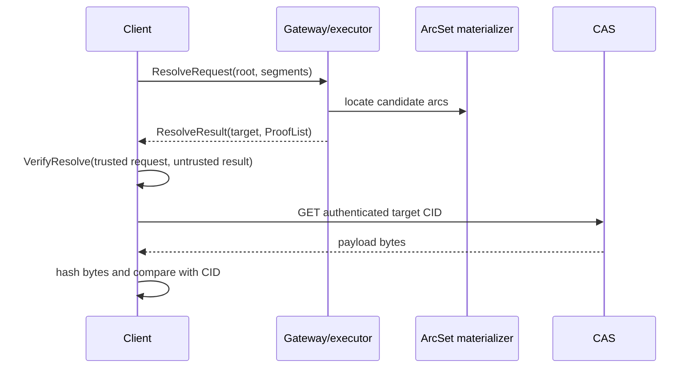

# MALT Core Architecture

## Purpose

This repository implements the protocol and algorithms required to produce and
verify arc-granularity graph authentication evidence. It is an SDK, not a
node, filesystem, object store, gateway product, or client application.

Correctness is rooted in a caller-selected root CID and local verification of
an operation-specific request/result pair. ArcTable, CAS, transport, cache, and
application state are outside the trust boundary.

## Responsibility model

| Layer | Owns | Explicitly excludes |
| --- | --- | --- |
| MALT core | arcs/segments, typed roots, commitments, resolve/read/mutation values, ProofList, verification | HTTP, CAS I/O, ArcTable implementation, application syntax, trusted-root policy |
| Client | application syntax, accepted roots, request construction, local proof and payload-byte verification | proof generation, ArcTable, server policy |
| Gateway/executor | candidate selection, proof generation, mutation execution, ArcTable/KV/CAS, service policy | the final trust decision |
| CAS | immutable CID-addressed bytes | graph semantics and ProofLists |

## Data flow



The gateway may return any complete valid derivation. If multiple derivations
exist, MALT does not require a proof of maximality, uniqueness, or longest-prefix
selection. Application policy may impose additional constraints.

## Package layers

```text
malt (module facade)
├── protocol                 serialized resolve/read profiles and schemas
├── mutation                 portable mutation/receipt values
├── auth
│   ├── arcset               canonical arcs and ArcSet views
│   │   └── materializer     caller-injected load/store capability
│   ├── commitment           KZG/IPA commitment primitives
│   ├── semantic             map/list contracts and algorithms
│   ├── proof                ProofList and evidence
│   └── verifier             storage-free portable verifier
├── execution                untrusted operation composition
├── graph                    resolver/writer algorithms
│   └── runtime              composition over an injected materializer
├── sdk/verifier             trusted client facade
├── wire/maltcid             typed CID rules
└── artifact                 frozen compatibility profile
```

`graph/runtime` means an in-process algorithm composition. It owns no process
lifecycle, HTTP route, KV database, ArcTable implementation, CAS backend, or
authoritative root.

## ArcSet and materialization

`auth/arcset` is the canonical in-memory/traversable representation used by
core algorithms. Proof generation also needs to load internal commitment nodes
and root-relative ArcSet views. The SDK therefore accepts small injected
capabilities:

```go
type Lookup interface {
    Get(context.Context, string, cid.Cid, arcset.Path) (cid.Cid, error)
    BatchGet(context.Context, string, cid.Cid, []arcset.Path) (map[arcset.Path]cid.Cid, error)
}

type Updater interface {
    Update(context.Context, string, cid.Cid, cid.Cid, arcset.ArcSet) error
}

type Snapshotter interface {
    Snapshot(context.Context, string, cid.Cid) (arcset.ArcSet, error)
}
```

`NodeStore` composes `Lookup + Updater`; `MutableStore` adds `Snapshotter`.
The full compatibility `Store` additionally supports iteration. These
interfaces describe algorithmic capability only. They do not define:

- ArcTable key formats or version chains;
- KV/SQL/object-store persistence;
- transactions or distributed consistency;
- namespace ownership or tenant meaning;
- cache, Bloom filter, GC, or lifecycle policy.

The gateway repository supplies the current persistent ArcTable/KV
implementation. Portable verification does not import `materializer`.

## Operation contracts

### Resolve

`ResolveRequest` contains a caller-selected root and segment array.
`ResolveResult` contains the target and ProofList. The executor may group
multiple segments into one canonical arc during longest-prefix discovery.
`VerifyResolve` proves the returned complete derivation against the request.

### Read

`ReadRequest` performs one typed primitive operation: `map_key`, `list_index`,
or `list_range`. `ReadResult` contains the target, optional authenticated range
segment CIDs, and ProofList. `VerifyRead` binds the evidence to the exact
caller-selected query.

Proof generation is part of resolve/read execution. There is no new generic
`prove` operation. `malt.artifact/v0alpha2` remains frozen compatibility data.

### Apply

`mutation` defines namespace-free semantic mutation values. `execution.Executor`
can apply them through an injected writer and returns an operational receipt.
The receipt is not a cryptographic state-transition proof. A returned root is a
candidate until the client accepts it under its own publication/freshness
policy.

`RuntimeGraph.Writer()` exposes only `MutationWriter`. Bootstrap creation is a
separate `StructureCreator` because a new structure has no authenticated base
root. Legacy `UpdateArc`, `BatchUpdateArcs`, and inspection helpers are exposed
only through the explicitly named `ReferenceWriter()` capability.

## Verification boundary

Trusted verification packages must remain deterministic and storage-free:

- `auth/verifier` verifies ProofList evidence;
- module-root `VerifyResolve` and `VerifyRead` bind caller-selected inputs;
- `sdk/verifier` exposes the local Go facade;
- `cmd/malt-verifier-wasm` exposes the same boundary to browsers.

They do not call a gateway, remote verifier, CAS, ArcTable, filesystem, or
network. Remote verify endpoints are diagnostics only.

Proof verification authenticates a target CID, not arbitrary response bytes.
The consuming client must hash full payload bytes, or validate each
application-defined ranged segment, against authenticated CIDs.

## Application boundary

UnixFS is not a core layout or package. It is a client application profile that
maps filesystem paths/manifests/chunks into core segment, mutation, resolve,
and read contracts. Its current implementation lives in `malt-client` and the
browser client.

A future TypeScript SDK may map `.` or `[]` object syntax into the same segment
arrays. Core does not parse those syntaxes. HTTP may naturally use `/`, while
RPC may transmit the array directly.

## Import guards

`architecture_test.go` enforces the trusted-layer dependency direction. In
particular, the module facade, portable mutation values, artifact compatibility
layer, and client verifier cannot import server, storage, application, or
runtime process packages. Removed product packages must not be reintroduced to
this module.
