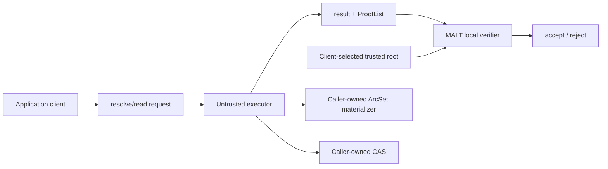

# MALT Core

[](https://github.com/dewebprotocol/malt/actions/workflows/go.yml)
[](LICENSE)

**MALT is an SDK and protocol implementation for arc-granularity graph data
authentication.**

MALT keeps payload bytes in content-addressed storage (CAS) and authenticates
typed relations with vector-commitment backends. A client verifies:

```text
trusted root + typed resolve/read request -> result + ProofList
```

The repository is deliberately application- and deployment-neutral. It does
not contain a gateway service, ArcTable implementation, CAS backend, command
line client, daemon, UnixFS model, or website.

[Documentation](./docs/README.md) · [Architecture](./ARCHITECTURE.md) ·
[Resolve/read contracts](./docs/spec/resolve-read-contracts.md) ·
[ProofList](./docs/spec/prooflist-format.md) ·
[Compatibility](./docs/policy/compatibility.md) ·
[v0.0.6 release](./docs/releases/v0.0.6.md) · [Roadmap](./ROADMAP.md)

## Boundary

MALT core owns:

- canonical segment and arc semantics;
- typed map/list roots and CID rules;
- map/list commitment, proof, and verification algorithms;
- `malt.resolve/v0alpha1` and `malt.read/v0alpha1` values and JSON Schemas;
- ProofList generation/verification semantics;
- portable mutation and receipt values;
- untrusted resolve/read/apply composition over caller-injected capabilities;
- native Go and browser/WASM verification.

MALT core does not own:

- HTTP routing or service policy;
- ArcTable, KV, SQL, cache, or durable materialization implementations;
- CAS access or payload lifecycle;
- trusted-root storage, freshness, publication, or multi-writer policy;
- UnixFS, TypeScript object syntax, or another application model;
- a CLI, client daemon, managed gateway, or website.

Those responsibilities are split across independent repositories:

| Repository | Responsibility |
| --- | --- |
| [`DeWebProtocol/malt-client`](https://github.com/DeWebProtocol/malt-client) | CLI/daemon plus separate transport, trusted-root policy, UnixFS, payload binding, and Merkle DAG compatibility layers |
| [`DeWebProtocol/gateway`](https://github.com/DeWebProtocol/gateway) | Untrusted native/compatibility profiles, runtime composition, ArcTable/KV/CAS backends, scope and publication policy |
| [`DeWebProtocol/malt-evaluation`](https://github.com/DeWebProtocol/malt-evaluation) | Reproducible evaluator, benchmark suites, comparison adapters, plans, and schemas |
| [`DeWebProtocol/malt-web`](https://github.com/DeWebProtocol/malt-web) | Browser client, local WASM verification, public website and tutorials |

## Core composition



An executor may use an ArcTable to accelerate candidate selection, including
longest-prefix discovery. The verifier proves the returned derivation; it does
not prove that the executor selected the unique or longest possible path. This
is intentional existential resolution semantics.

The core exposes narrow capabilities under `auth/arcset/materializer`:
read-only lookup, node update, snapshot, and optional iteration. The full
`Store` aggregate is retained for adapter compatibility, while each algorithm
accepts only the capability it uses. Implementations and persistence policy
remain outside this module. The included memory implementation exists for
conformance tests and examples, not deployment.

## Install

```bash
go get github.com/dewebprotocol/malt@v0.0.6
```

### Verify a resolve result

```go
verifier, err := sdkverifier.NewDefault()
if err != nil {
    return err
}

err = verifier.VerifyResolve(ctx, protocol.ResolveVerification{
    Request: request, // independently constructed by the client
    Result:  result,  // untrusted gateway response
})
```

Verification performs no network, CAS, ArcTable, filesystem, or gateway I/O.
Applications that consume payload bytes must additionally hash those bytes
against the authenticated CID. Application-specific range composition belongs
in the application client.

## Packages

| Package | Role |
| --- | --- |
| module root `malt` | Stable typed resolve/read/query values and verification entry points |
| `auth/arcset` | Canonical typed arcs, targets, sets, and iteration |
| `auth/commitment` | KZG/IPA commitment capabilities |
| `auth/semantic` | Map/list semantic contracts and reference algorithms |
| `auth/proof` | ProofList/evidence formats |
| `auth/verifier` | Storage-free ProofList verification |
| `protocol` | Versioned serialized resolve/read profiles and schemas |
| `mutation` | Portable mutation and receipt values |
| `execution` | Untrusted resolve/read/apply composition |
| `graph` | Resolver, semantic mutation, bootstrap, and explicit reference-writer algorithms over injected capabilities |
| `sdk/verifier` | Client-facing local verification facade |
| `artifact` | Frozen `malt.artifact/v0alpha2` compatibility decoder/verifier |
| `cmd/malt-verifier-wasm` | Browser verifier build entry point |

## Development

```bash
go test ./...
go vet ./...
go build -buildvcs=false ./...
scripts/build-verifier-wasm.sh dist/verifier
```

MALT is pre-v1 and experimental. Pin exact releases and reject unknown protocol
profiles. See [compatibility policy](./docs/policy/compatibility.md).
