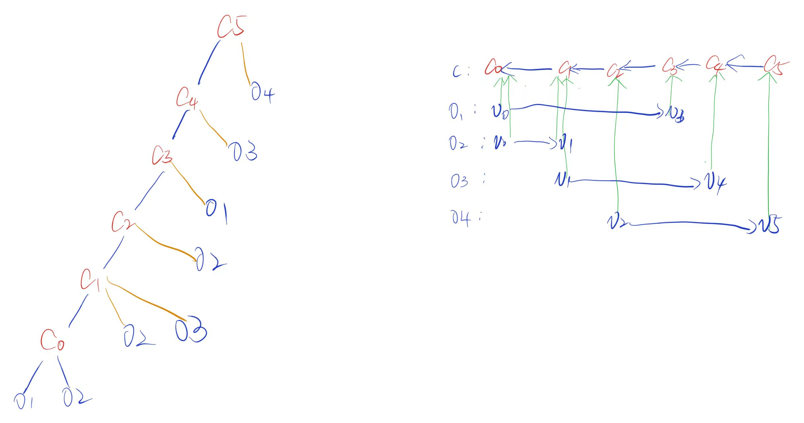

# 1. Introduction

基于默克尔有向无环图（Merkle DAG）的内容寻址存储系统（如IPFS~\cite{benet2014ipfs}）已被证明在不可变内容分发、复制和完整性验证方面极为高效。这类系统通过将对象身份与内容绑定，提供了强大的密码学保证，从而实现可扩展的去中心化存储。然而，许多构建在去中心化存储之上的新兴应用日益需要支持**演化结构**——即随时间变化但仍保持稳定身份与可验证关系的对象逻辑组织。

在基于默克尔DAG的系统中，结构是隐式表达的。遍历关系通过哈希链接直接编码到对象内容中，最终形成的结构会作为对象身份的一部分被密码学固化。这种设计非常适合不可变数据，但它从根本上将结构演化与对象身份耦合在一起。因此，任何结构变更（例如扩展集合、重组引用或重新定义遍历语义）都必然会产生新的对象标识符，并沿祖先路径传播更新。这些影响在实践中表现为遍历延迟增加和重写开销，但更深层次反映了默克尔DAG模型中结构的表达与固化方式。

这种耦合并非特定实现产生的人为产物，而是将结构视为对象内容隐式属性的必然结果。当遍历语义和结构关系被直接编码到不可变对象中时，结构只能通过改变对象身份来实现演化。试图缓解这些代价的系统会将演化结构外化为由应用管理的辅助状态（例如可变指针或索引）。虽然这些方法在实践中有效，但由于将结构移出了内容寻址提供的密码学闭包，它们削弱了端到端的可验证性。

本文提出**可变结构层**（MALT），这是内容寻址存储之上的系统级抽象，能在保持密码学可验证性的同时将结构与数据分离。MALT并非提出新的存储基础设施或数据结构，而是通过将结构作为具有独立验证边界的显式可演化实体，对现有不可变对象存储形成补充。遍历关系被表示为显式固化的结构元素（如弧），这些元素独立于对象内容，且无需重写底层对象即可演化。

通过改变结构演化与验证的基本单元，MALT使得应用能够独立于不可变数据来表达和更新逻辑组织，同时在不信任存储和解析的情况下保持密码学完整性。验证以节点相对（root-relative）、可组合（compositional）的方式执行：遍历计算可委托给不可信的解析器执行，而客户端则根据显式固化的结构验证每个遍历步骤。该设计保持了对现有内容寻址系统的兼容性，并支持隐式与显式结构共存的混合部署。最关键的是，MALT不会改变底层内容寻址存储的对象身份、内容寻址或存储语义。

总结而言，本文作出以下贡献：

1. 我们指出了基于默克尔有向无环图（Merkle DAG）的内容寻址存储系统（CAS）存在结构性缺陷：将结构隐式嵌入对象内容会导致结构演变与对象标识强耦合，从而在保持密码学安全性的前提下，难以灵活表达和验证动态变化的结构。
2. 我们提出名为MALT的互补抽象层（complementary abstraction），通过显式且可演进的结构表示（makes structure explicit and evolvable），使得逻辑组织能够独立于不可变对象内容进行修改，同时维持密码学可验证性。
3. 我们设计了节点相对的组合式验证模型，将遍历执行与正确性验证解耦，允许不受信任的组件解析结构，并由客户端完成本地验证。
4. 实验证明，MALT可作为兼容性覆盖层实现在现有CAS系统之上，无需修改对象格式或存储语义即可支持混合遍历模式。

# 2. Background and Problem Analysis

默克尔有向无环图（Merkle DAG）构成了许多内容寻址存储系统的结构支柱，为数据完整性和不可篡改性提供了强有力的保障。然而，当将其应用场景从不可变归档扩展到网络环境中编码应用层语义时，默克尔DAG暴露出若干根本性局限。本节将从基本原理出发剖析这些局限性：我们首先论证遍历与重写操作的内在耦合会导致网络化内容寻址存储系统产生不可避免的性能损耗，进而指出默克尔DAG的表达能力边界会彻底阻碍某些语义关联的呈现。这些局限性表明，我们需要在默克尔DAG之上构建额外的抽象层。

## 2.1 Merkle DAGs and Implicit Traversal

在基于Merkle DAG的系统中，对象是不可变的，并通过其内容的加密哈希值进行标识。遍历关系通过嵌入父对象中的哈希链接隐式表示，客户端可通过递归跟随这些链接从根对象导航至其派生对象。该模型提供了强大的完整性保证：对对象的任何修改都会改变其标识符，并能够立即被检测到。然而，定义遍历语义的哈希链接同时也决定了更新如何在结构中传播。图~\ref{fig:rewrite}展示了一个典型默克尔DAG中哈希链接的这种双重作用。

Fig.1 Traversal and rewrite in a Merkle DAG. Hash links define traversal from parent to child, while any modification propagates in the reverse direction, requiring recomputation of all ancestor hashes. Traversal and rewrite operate over the same implicit arcs but in opposite directions.

如图 1 所示，遍历操作沿着哈希链接从父节点向子节点进行，而对叶子节点的任何修改则会沿相反方向传播：从子节点到父节点，这需要重新计算祖先节点的哈希值。关键在于，遍历与重写遵循同一组隐式弧线，但方向相反。因此，任何改变遍历关系的结构演化，都必然引发遍历所依赖路径上的重写操作，从而直接将遍历性能与更新传播紧密关联。

这种方向反转具有重要影响。由于每个父节点都承诺其子节点的哈希值，更新后代对象需要重新计算从该节点到根节点路径上所有祖先的内容（即标识符）。因此，这种重写传播本质上具有祖先依赖性：只有能够访问完整祖先链的实体才能执行此操作，无论是通过本地维护还是额外通信获取。在分布式CAS系统中，当祖先节点位于远程节点或从本地缓存中清除时，这种依赖关系会直接转化为结构更新时的重写放大和额外的元数据流量。

遍历与重写的强耦合性不仅是效率问题。它从根本上限制了基于Merkle DAG系统的结构演化方式。即使底层数据保持不变，看似轻量的结构更新（如扩展集合或聚合新增引用）也会触发遍历路径上的递归重写。在下一小节中，我们将探讨这种结构特性如何在常见的演化工作负载中表现为重写放大和元数据放大。

## 2.2 Evolving Structure and Rewrite Amplification

许多构建在内容可寻址存储（CAS）上的应用不仅需要不可变数据，还需要具备**结构演化**能力：即对象的逻辑组织会随时间变化，而先前创建的对象仍保持有效且可寻址。典型场景包括扩展集合、将现有对象按新逻辑分组聚合，或在不修改底层数据的情况下重组遍历路径。

在基于默克尔有向无环图（Merkle DAG）的系统中，此类结构演化通过遍历关系来实现。然而，当遍历语义通过嵌入对象内容的哈希链接隐式表达时，结构演化便与对象身份密不可分。这导致即使是逻辑上局部的结构变更，也会引发对象重写和元数据膨胀。我们通过分析几种典型的结构演化模式来剖析这一现象。

### 2.2.1 Append and Extension

追加和扩展操作会在现有逻辑结构中引入新元素。从概念上讲，这类操作是局部的：新增一个对象，而既有元素保持不变。但在隐式遍历机制下，要表达新的遍历关系，就必须在父对象中嵌入额外的哈希链接。

由于对象标识符由内容派生，修改父对象会改变其标识符，进而迫使所有引用它的祖先对象都必须重写。因此追加操作的成本并不取决于更新规模，而是与遍历结构的高度成正比。即使被追加的对象与现有数据无关且未修改任何既有关系，这种成本放大效应依然存在。

### 2.2.2 Aggregation and Reorganization

聚合与重组改变了现有对象在逻辑上的分组或遍历方式。聚合引入了新的逻辑父级，这些父级引用了一组现有对象；而重组则在不改变对象本身的情况下，调整遍历路径或层级结构。

尽管这些操作在语义上有所不同，但在隐式遍历下会引发相同的重写行为。任何新引入或修改的遍历关系都必须编码到对象内容中，从而改变对象标识符并触发所有依赖祖先的递归重写。因此，隐式遍历将语义上不同的结构演化形式统一为单一操作模式：通过重写对象内容来反映更新后的关系。

### 2.2.3 Metadata Amplification and Ancestor Dependency

隐式遍历下的重写放大本质上并非非局域性的，但其根本上是**依赖祖先的**。执行结构更新需要访问所有内容中嵌入了受影响遍历关系的祖先节点。这种访问可以通过本地状态（如版本控制系统）提供，也可以通过从存储中检索祖先对象来实现。

在大型或分布式环境中，这种祖先依赖性会转化为显著的元数据移动和协调开销。即使应用层级的变更很小，更新操作也需要沿着整个依赖链重建并传播修改后的标识符。随着结构深度或扇出的增加，维护演化中结构的成本逐渐超过存储或传输数据本身的成本。

### 2.2.4 Semantic Coupling Under Implicit Traversal

除了重写放大之外，隐式遍历还会引发一个更微妙的问题：它迫使遍历语义、应用语义和真实性约束被编码在同一个对象内容中。当遍历关系通过哈希链接隐式提交时，任何需要验证的语义关系都不得不与有向无环图（DAG）的遍历结构保持一致。

考虑这样一个应用场景：由不同作者独立创建的对象必须能够被验证彼此关联。例如，一个对象可能代表某个主体撰写并签名的声明或贡献，同时在逻辑上引用或回应另一个由不同主体创建的对象。从遍历的角度来看，人们自然会期望从被引用的对象导航到与之关联的响应集合。然而，从真实性的角度来看，每个响应都必须通过密码学方式绑定到被引用的对象，以证明其来源。在隐式遍历下，这些需求是相互冲突的。为了使关联可验证，被引用对象的标识符必须嵌入到响应对象的内容中。这样一来，应用层级的语义被编码在与预期遍历方向相反的位置。遍历语义和真实性约束在对象内容中纠缠在一起，尽管它们源于不同的关注点。

虽然可以通过引入额外的聚合对象来显式编码遍历规则以解决此类冲突，但这样做会将遍历语义提升到更高层次的结构节点中。这种方法增加了结构的复杂性，引入了额外的元数据，并且在关系或语义演变时扩大了重写传播的范围。因此，冲突并未消除，而是转移到了辅助结构中，其维护成本随着语义丰富度和结构规模的增加而增长。

这种现象反映了隐式遍历的一个更广泛的局限性：当遍历关系是提交结构的唯一机制时，语义上不同的关系被迫共享相同的表示通道。因此，不断演变的应用语义和可验证关联会系统地引发结构重写或辅助间接引用。

### 2.2.5 Implications

综上所述，这些例子表明，重写放大效应以及遍历与应用层语义之间的纠缠（ **Entanglement** ）并非特定 workload 或 implementation 的产物。这些问题就会出现，是由于遍历语义倍父对象隐式引用导致。在此模型下，结构演化与语义关系从根本上与对象身份绑定，从而在不可变的内容寻址与轻量级、语义灵活的更新之间形成了固有矛盾。

实践中，系统常将动态变化的遍历或语义关系外化为辅助状态，以避免递归重写。但这类方法以牺牲密码学可验证性为代价换取灵活性，需要依赖外部协调机制或可变元数据的可信性。

这一发现促使我们需要一种新抽象——它能让遍历关系独立于对象内容演化，同时保持密码学可验证性。下一小节将介绍MALT的设计目标，该方案通过将结构显式定义为内容寻址存储之上可演化、可验证的实体来应对这一挑战。

## 2.3 Design Goals

MALT旨在支持在不可变的内容寻址存储之上实现可验证且可演化的结构化数据。如附录A所述，Merkle DAG通过嵌入对象内容中的哈希链接直接编码结构关系。这种设计将遍历语义与对象身份传播紧密耦合，从而限制了结构布局，增加了证明和更新的成本，并制约了结构关系的表达能力。

为了解决这些限制，MALT围绕以下目标进行设计。

### **3.1.1 Low-Latency Structural Retrieval**

遍历结构应能采用浅层布局，以最小化在结构解析过程中访问的对象数量。在 Merkle DAG 中，浅层布局会导致证明规模庞大且重写成本（rewrite）高昂，因为结构关系被嵌入到对象内容中。MALT的目标是消除这一限制，使得遍历布局可以针对低延迟检索进行优化，而不会产生高昂的证明或更新成本。

### **3.1.2 Verifiable Structural Relations**

对象之间的结构关系必须能够通过密码学验证。客户端应能在**不检索或验证整个结构**的情况下，验证特定结构关系的存在。这需要能在单个结构关系（individual structural relation）层面而非对象级哈希链接层面运作的验证机制。

### 3.1.3 Localized Structural Evolution

结构更新应当局部化。修改结构关系时，只应影响对应的关系，而不应触发对祖先对象或结构中无关部分的改写。消除这种改写放大效应（write amplification），对于在不可变对象上支持可变结构至关重要。

### 3.1.4 **Expressive Structural Relations**

系统应支持灵活的结构关系，不受哈希链接编码限制的约束。在默克尔有向无环图中，对象引用必须在构建时嵌入父对象中，这限制了可表示结构的范围。MALT通过显式表示结构关系消除了这一限制，使应用程序能够定义自然反映其语义的结构图。

# 3. System Model

MALT提出了一个面向内容寻址存储的结构层，该层通过显式弧表示对象间的关系。与直接将遍历关系以哈希链接形式嵌入对象内容不同，MALT通过对显式弧集合的承诺来验证结构关系。这种设计使得结构关系在保持密码学可验证性的同时能够动态演化，并支持针对单个弧的高效证明生成。

从结构上看，MALT将对象建模为带标签图中的节点。对象间关系通过路径标签标识的显式弧来表达。每个对象的出弧构成一个弧集，该集合通过结构承诺进行认证。客户端通过基于这些承诺生成的证明来解析结构关系。

后续章节将详细阐述数据模型、认证结构抽象机制，以及用于检索和验证弧的解析方法。

| 符号 | 含义 |
| --- | --- |
| $v$ | 对象（object） |
| $p$ | 路径（path） |
| $c$ | 对象标识符（CID） |
| $\mathcal{A_v}$ | 结构集合，对象出边的arc集合 |
| $C_v$ | 结构承诺（Commitment） |
| $\pi$ | 证明 |

## 3.1 Data Model

MALT将系统建模为**带路径标签的有向结构图。**

形式上，一个对象 $v$ 被表示为：

$$
Object_v = (payload_v, structure_v)
$$

其中：

- $payload_v$ 为对象内容
- $structure_v$ 为描述对象的结构关系

结构关系通过显示弧表示。

~~在Merkle DAG中，对象的身份被定义为：~~

$$
Id_v = H(Serialize(Object_v))
$$

~~其中：~~

- ~~Serialize为序列化函数（multicodec）~~
- ~~H为hash函数~~

### Definition 1 (Explicit Arc)

显式弧是从一个对象到另一个对象的带标签关系：

$$
(v, p, c)
$$

其中：

- $v$ 是原对象
- $p$ 为路径标签
- $c$ 为目标对象的CID

该弧表示结构弧：

$$
v\xrightarrow{p} c.
$$

### Arc Sets

对于对象 $v$ ，其所有出弧组成集合：

$$
\mathcal{A_v} = \{(p, c)\}
$$

该集合描述对象 $v$ 的全部结构关系。

$~~structure_v$ 被弧集 $\mathcal{A_v}$ 表示，因此对象可以表示为： $Object_v = (payload_v, \mathcal{A_v})$ 。~~

在3.2节中，将通过结构承诺对 $\mathcal{A_v}$  进行认证。

## 3.2 Structure Commitment

为了对结构关系进行认证，MALT 使用**结构承诺（structure commitment）**对对象的 arc 集合进行加密绑定。

给定对象 $v$ 的 arc 集合 $\mathcal{A_v}$ ，其结构承诺定义为

$$
C_v = Commit(\mathcal{A_v})
$$

该承诺对对象 $v$ 的所有出弧进行绑定，使得任何结构关系都可以通过证明进行验证，而无需访问完整的 arc 集合。

### 3.2.1 Commitment Interface

MALT 将结构认证抽象为四个基本操作：

**Commit**

$$
C_v = \mathrm{Commit}(\mathcal{A_v})
$$

生成 arc 集合的结构承诺。

**Prove**

$$
\pi = \mathrm{Prove}(C_v, (p, c))
$$

生成 arc $(p, c)$ 属于集合 $\mathcal{A_v}$ 的证明。

**Verify**

$$
\mathrm{Verify}(C_v, (p, c), \pi) \rightarrow \{true, false\}
$$

验证 arc  $(p, c)$ 是否由承诺 $C_v$ 认证。

正确性要求：

$$
(p,c)\in \mathcal{A_v} \Rightarrow \mathrm{Verify}(C_v,(p,c), \mathrm{Prove}(C_v,(p,c))) = \texttt{true}
$$

这种抽象性使得MALT能够支持不同的承诺方案（如IPA、KZG等）。

### 3.2.2 Incremental Updates

结构承诺支持对 arc 集合的**局部更新**。

当某个 arc 被修改：

$$
(p, c) \rightarrow (p, c^{\prime})
$$

新的结构集合为：

$$
\mathcal{A_v}^\prime = (\mathcal{A_v} - \{(p, c)\}) \cup \{(p, c^\prime)\}
$$

系统随后更新结构承诺：

$$
C_v^{\prime} = \mathrm{Update}(C_v, p, c_{old}, c_{new})
$$

在实际实现中， $Update$  仅重新计算受影响的结构部分，而不需要重新构建整个承诺结构，并使其能够验证更新后的弧集 $\mathcal{A_v^\prime}$ 。

这种设计使结构关系能够在保持可验证性的同时支持局部演化。

## 3.3 Resolution Semantic
给定对象结构承诺 $C_v$ 和路径 $p$，解析操作定义为：

$$
\mathrm{Resolve}(v, p) \rightarrow (c, \pi) \;|\; \bot
$$

其中：

- $c$ 为路径 $p$ 指向的目标对象 CID
- $\pi$ 为证明 $(p, c)$ 属于结构集合 $\mathcal{A_v}$ 的认证证明

客户端随后执行：

$$
\mathrm{Verify}(C_v, (p, c), \pi)
$$

若验证成功，则证明该结构关系由承诺 $C_v$ 认证。
## 3.4 System Guarantees
### **3.4.1 Decoupled Traversal**
- raversal cost independent of structure depth
### **3.4.2 Local Verifiability & Compositional Verification**
- 每一步 resolution 都是局部可验证
### **3.4.3 Bounded Update Scope**
- limited rewrite amplification
# 4. System Design

## 4.1 System Overview

图2：MALT架构。MALT作为覆盖层运行在内容寻址存储系统之上。结构关系通过显式弧表示，并由显式弧解析器（EAR）进行解析。EAR维护一个弧索引表（EAT），并与结构提交引擎（SCE）交互，为结构查询生成可验证的证明。

MALT 被设计为一个构建在不可变的内容寻址存储网络之上的覆盖层。底层存储继续管理由内容标识符（CID）标识的不可变对象，而 MALT 则提供了一个可验证的可变层，用于表示和演化对象之间的结构关系。通过将结构关系与对象内容分离，MALT实现了灵活高效的结构遍历，而无需修改底层 CAS 模型。

MALT的核心概念是**显式弧**，用于表示对象之间的结构关系。MALT 不是通过对象内部的哈希链接编码关系，而是维护描述对象如何连接的显式弧集合。这些弧集通过**结构承诺**进行认证，使客户端能够验证单个结构关系的存在性，而无需检索或认证整个对象。

为了支持对显式弧的可验证遍历，MALT 引入了一个名为**显式弧解析器（EAR）**的系统组件。EAR负责解析结构关系并生成加密证明，以证明所解析弧的正确性。在内部，EAR维护一个显式弧索引，并与承诺层交互，为结构查询生成和验证证明。

从高层次来看，MALT中的结构遍历过程如下：客户端从表示结构根的结构承诺开始，针对特定弧标签发出查询。EAR解析相应的弧，并返回引用的对象以及证明该弧包含在已提交结构中的证明。客户端可以根据根承诺验证此证明，确保遍历结果的真实性。结构更新通过更新相应的弧条目和关联的结构承诺来处理，无需重写不相关的对象。

这种设计将遍历语义与哈希链接编码分离，同时保留了加密可验证性。因此，可以独立于对象身份传播优化遍历布局，从而实现高效的结构遍历和局部结构更新。

## 4.2 Explicit Arc Resolver (EAR)

EAR是 MALT 的结构解析组件，用于根据路径解析对象之间的结构关系，并生成可验证的结构证明。

EAR 通过协调两个内部组件完成解析过程：

- **Structure Commitment Engine(SCE)**: 用于生成证明；
- **Explicit Arc Table(EAT)**: 用于快速定位 arc 条目。

### 4.2.1 Structure Commitment Engine(SCE)

Structure Commitment Engine（SCE）负责结构承诺的生成、更新以及证明生成。

SCE 实现了 **3.4.1 节中定义的结构承诺接口**，包括以下操作：

- `Commit`：生成 arc 集合的结构承诺
- `Update`：对承诺结构进行局部更新
- `Prove`：生成某个 arc 的认证证明
- `Verify`：验证 arc 是否由承诺认证

通过将这些操作封装在 SCE 中，MALT 能够支持多种不同的结构承诺实现。

### 4.2.2 Explicit Arc Table (EAT)

为了高效定位 arc 条目，MALT维护了一个显示弧表（Explicit Arc Table，EAT）。

EAT 是一个将承诺根与路径映射到 arc 目标的索引：

$$
(C_v, p) \rightarrow c
$$

EAT 作为结构承诺的辅助索引，使系统能够在不扫描完整 arc 集合的情况下定位弧目标。

## 4.3 Resolution Procedure

给定 $(C_v, p)$ ，EAR 通过以下步骤解析 arc：

1. 在 EAT 中执行索引查找：

$$
(C_v, p) \rightarrow c
$$

若未找到匹配条目，则返回 $\bot$。

2. 调用 SCE 生成认证证明：

$$
\pi = \mathrm{Prove}(C_v, (p, c))
$$

3. 返回解析结果：

$$
(c, \pi)
$$

客户端通过执行：

$$
\mathrm{Verify}(C_v, (p, c), \pi)
$$

即可验证解析结果的正确性。

## 4.4 Versioned Resolution

由于结构承诺在更新后会产生新的承诺根，EAT 条目按照其插入时的承诺根进行索引。当某个 arc 被更新时，仅修改的条目会在新的承诺根 $C_v'$ 下插入，而未修改的条目仍然保留在旧承诺根下。因此，解析操作可能需要沿承诺谱系执行查找，直到找到匹配条目。形式上：

$$
Resolve(C_v, p)
$$

返回在承诺谱系中遇到的第一个匹配条目，随后根据最新的承诺 $C_v$ 生成证明：

$$
\pi = Prove(C_v, (p, c)).
$$

为限制谱系查找深度，系统可以选择在较新的承诺根下复制未修改条目，从而缩短解析路径。（该策略在实现章节中通过 Copy-on-Write 机制实现。）

## 4.5 Layout Considerations

MALT 并不强制规定对象的具体结构布局。应用程序可以自由地根据其语义结构使用显式弧来组织对象。

然而，布局的选择会影响更新的局部性和验证开销。

在传统的基于Merkle DAG的系统中，通常采用分层布局来限制对象的扇出并控制证明大小。由于结构关系嵌入在对象哈希中，修改子对象通常需要重新计算从该对象到根路径上的所有祖先对象。

相比之下，MALT 通过结构承诺将结构关系与对象内容解耦。因此，更新操作仅影响被修改的弧条目及相应的承诺，而不会在整个层次结构中传播。

因此，在 MALT 中，更扁平的布局通常能提供更好的更新局部性。当一组相关对象被组织在单一承诺下时，修改单个弧只需更新对应的承诺条目，而不会触发跨多个结构级的级联更新。

重要的是，MALT 在使用分层布局时不会引入额外开销。因此，应用程序可以选择最符合其语义结构的布局，同时享受可验证弧解析带来的优势，这种灵活性使应用程序能够基于语义组织而非加密约束来选择布局。

# Appendix

## A. Merkle DAGs的结构性性能限制

本附录描述了在对象大小受限的情况下，默克尔有向无环图的结构性限制。

### A.1 Size Constraint and Depth Lower Bound

设 $S_{\max}$ 为最大对象大小， $\lambda$ 为子引用的大小， $N$ 为从可信根可到达的认证对象数量， $\delta(v)$ 为认证对象 $v$ 必须解析的对象数量。

由于每个对象最多只能存储

$$
f_{\max} = \left\lfloor \frac{S_{\max}}{\lambda} \right\rfloor
$$

个子引用，扇出在物理上是有限的。

在最大扇出数 $f_{\max}$ 的限制下，深度为 $d$ 的层次结构最多可包含 $f_{\max}^d$ 个对象。因此，容纳 $N$ 个对象需满足

$$
\max_v \delta(v) \;\ge\; \log_{f_{\max}} N.
$$

因此，在对象大小限制下，对数认证深度是不可避免的。

### A.2 Depth-Induced Cost

认证需要按照引用顺序进行解析。那么对于任意对象 $v$ ：

$$
L_{\mathrm{read}}(v) = \Omega(\delta(v)),
\qquad
\text{rewrite}(v) = \Omega(\delta(v)).
$$

认证延迟、证明大小、重写传播和锁定范围均随解析深度线性增长。

即使在最优布局下，最坏情况的修改也会影响 $\Omega(\log_{f_{\max}} N)$ 个对象。

### A.3 Fanout Utilization and Sparse Penalty

只有当内部节点被充分利用时，才能达到下限。设 $\bar f$ 为平均扇出。

那么

$$
\max_v \delta(v) \;\ge\; \log_{\bar f} N,
\qquad
\bar f \le f_{\max}.
$$

当 $\bar f < f_{\max}$ 时，深度严格超过结构最小值。

因此，结构上的低效会直接增加认证和重写的成本。

### A.4 Semantic Coupling Under Implicit Traversal

在隐式默克尔有向无环图中，遍历结构、对象标识和真实性约束都被编码在哈希承诺中。因此，任何可验证的语义关系都必须嵌入到遍历结构中。

当应用语义与树形遍历不匹配时，需要额外的聚合或间接节点来保持真实性。

这些辅助节点：

- 引入额外的结构层，
- 降低有效扇出利用率，
- 增加认证深度。

因此，语义的丰富性会系统地引发结构扩展，进而增加延迟、证明规模、重写传播以及并发锁的范围。

### A.5 Summary

在对象大小受限的情况下，默克尔有向无环图结构表现出：

- 不可避免的对数深度下界，
- 深度的线性成本放大，
- 对扇出利用不足的敏感性，
- 语义耦合下的结构扩展。

这些限制源于身份、遍历和承诺在单一结构内的耦合。