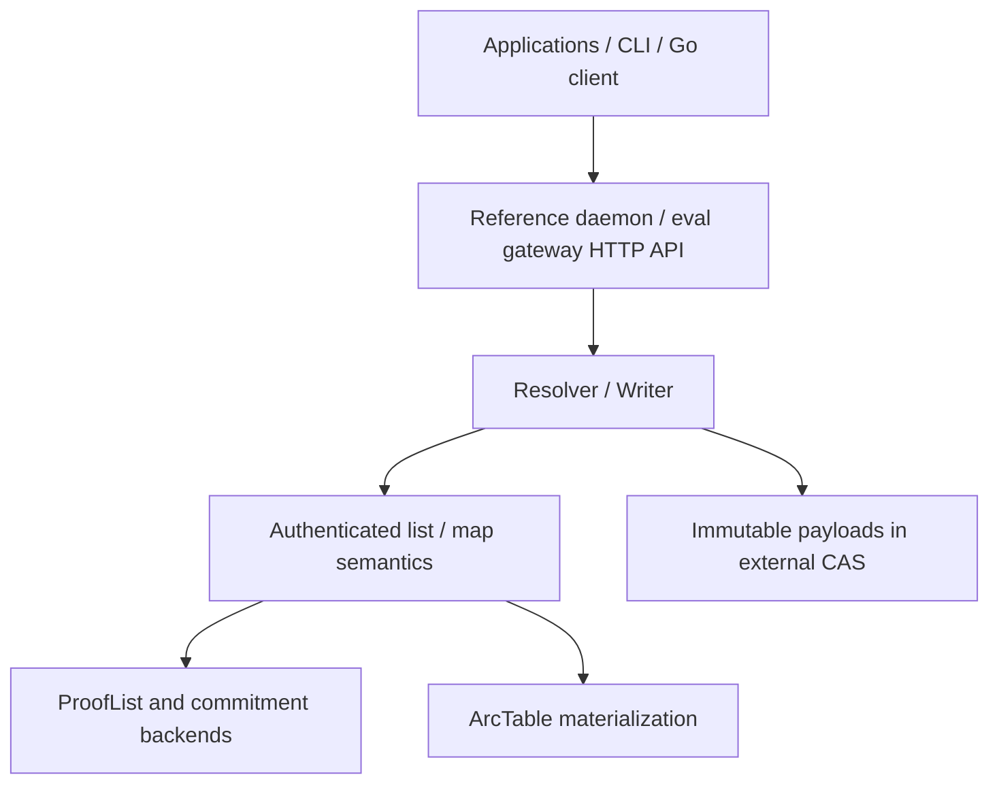

# MALT

[](https://github.com/dewebprotocol/malt/actions/workflows/go.yml)
[](LICENSE)

**MALT is a verifiable mutable structure layer for content-addressed data.**

It lets applications update and resolve authenticated relationships among
immutable objects without rewriting unrelated payload blocks.

This repository is the MALT core specification implementation. It owns the
verifier-facing semantics, ProofList behavior, root/query/result contracts,
wire formats, reference runtime, and core benchmark/evaluation framework. The
managed product gateway lives outside this repository.

[Documentation](./docs/README.md) · [Architecture](./ARCHITECTURE.md) ·
[Threat Model](./docs/policy/threat-model.md) ·
[Compatibility](./docs/policy/compatibility.md) · [Evaluation](./docs/evaluation/README.md) ·
[MIPs](./docs/mips/README.md) ·
[Roadmap](./ROADMAP.md) · [Security](./SECURITY.md) ·
[Contributing](./CONTRIBUTING.md)

MALT targets authenticated structured data: data whose relationships can be
normalized into graph-shaped nodes and relations. Example workloads include
verifiable local-first files, persistent agent memory, mutable manifests, and
tamper-evident audit trails over Filecoin, IPFS, S3, local CAS, or another
object store.

MALT authenticates those structural relationships through list/map semantics,
roots, and verifier-facing ProofLists. Immutable payload bytes can still live
naturally in ordinary CAS blocks and keep ordinary CIDs; MALT binds structure
to those payload objects without making the daemon, cache, or materialized index
state trusted.

**Status:** Experimental reference implementation. Runnable end to end, not
production-ready.

## Why This Exists

Traditional Merkle-DAG traversal authenticates structure by embedding child
links in parent content. A local structural change can force rootward object
rewrites because the relationship and the object identity are coupled.

MALT separates those concerns:

- graph-shaped structure is authenticated by independent structure roots
- list/map semantics define typed read and write operations
- reads return verifier-facing `ProofList` evidence
- immutable payload content can remain ordinary CAS data
- local structure updates advance structure roots without rewriting unrelated
  payload objects

The claim is not that updates are free. The claim is that MALT replaces
implicit ancestor-rewrite cost with explicit, verifiable structure maintenance.

## Repository Boundary

This repository owns:

- MALT core semantics and verifier-facing contracts
- root CID, ProofList, and wire-format documentation
- reference CLI, daemon, HTTP server, and local/mock CAS surfaces
- component benchmarks, conformance tests, and end-to-end evaluation harnesses
- implementation-bound MIPs and evaluator schemas

This repository does not own production managed-gateway behavior:

- tenant isolation, identity providers, API keys, or authorization policy
- root publication, latest-head, freshness, or multi-writer product policy
- S3/Filecoin/IPFS production backend orchestration
- quota, billing, pinning, garbage collection, abuse control, or operations

Those deployment and product concerns belong in the separate
`DeWebProtocol/gateway` repository or private deployment overlays.

## Current Architecture



Applications interact with resolver and writer surfaces. List/map semantics own
the authenticated structure. ArcTable is materialized runtime state, not a trust
root. Payloads remain immutable CAS objects, and proofs are verifier-facing.

## Current Status

MALT is an experimental reference implementation. It is runnable end to end, but
its public APIs, ProofList schemas, wire formats, and deployment policies may
change. It is not production-ready.

Current in-tree capabilities:

- root-centric `malt` CLI for local daemon lifecycle, add, resolve, and verify
- reference/evaluation gateway surface for explicit-root HTTP reads and writes
- proof-bearing HTTP reads for file bytes, directory JSON, and byte ranges
- pure MALT UnixFS-style layout built from map/list semantics and CAS-backed
  immutable payloads
- stateless commitment backends for semantic proof primitives
- ArcTable-backed structure materialization with overwrite and versioned modes
- `malt-eval` workloads for read queries, write traces, CAS models, proof
  overhead, and storage overhead

Current experimental boundaries:

- no managed global head publication service
- no multi-writer merge or freshness protocol
- no tenant, quota, pinning, or garbage-collection policy
- no production managed gateway or hosted service semantics
- no stable public API compatibility guarantee yet
- response-body binding for large-file byte ranges is still a ProofList-schema
  design item

## Use Cases

### Verifiable Agent Memory

Agents can update named memory, artifacts, checkpoints, and audit records while
clients verify that resolved objects belong to an accepted structure root.

### Local-First Files And Directories

Applications can model files and directories using authenticated map/list
semantics while retaining immutable content-addressed payload blocks.

### Mutable Manifests And Audit Trails

MALT can authenticate evolving manifests, registries, and ordered records
without embedding every mutable relationship into payload object identity.

MALT is storage-backend independent. Filecoin, IPFS, S3, and local CAS systems
provide payload storage; MALT provides authenticated mutable structure,
resolution, and verification above those payload objects. MALT is not a
replacement for Filecoin, IPFS, Kubo, S3, or a general-purpose object store.

## Quick Start

Prerequisites:

- Go 1.25.7 or newer
- Git

Build the three local binaries:

```bash
mkdir -p bin
go build -buildvcs=false -o bin/malt ./cmd/malt
go build -buildvcs=false -o bin/cas ./cmd/cas
go build -buildvcs=false -o bin/malt-eval ./cmd/eval/malt-eval
```

Initialize the local runtime. The default configuration expects an external CAS
at `127.0.0.1:4318` and a daemon API at `127.0.0.1:4317`. For local development
without a real IPFS node, start the standalone mock CAS server first:

```bash
bin/cas start
```

Then initialize and start the daemon:

```bash
bin/malt init --non-interactive
bin/malt start
bin/malt status
```

Add a file, resolve it, and verify the returned ProofList:

```bash
printf 'hello malt\n' >/tmp/malt-hello.txt
ROOT=$(bin/malt add /tmp/malt-hello.txt | awk '/Result root:/ {print $3}')
bin/malt resolve "$ROOT" malt-hello.txt >/tmp/malt-resolve.json
bin/malt verify --prooflist /tmp/malt-resolve.json
```

This example stores file bytes through the configured local CAS, produces a
MALT structure root, resolves a path relative to that root, and verifies the
returned target and ProofList against the trusted root.

Stop the managed daemon when finished:

```bash
bin/malt stop
```

## Developer Workflow

Run the full Go validation suite from the repository root:

```bash
go test ./...
go vet ./...
```

Inspect the command surfaces:

```bash
bin/malt --help
bin/malt-eval --help
bin/malt-eval schema
```

Run the local smoke evaluation plan:

```bash
bin/malt-eval run --plan examples/eval-smoke-plan.json --run-id smoke
```

The evaluator writes disposable workspace state under `output/<run_id>` and
durable result artifacts under `result/<run_id>`. Those directories are ignored
by git.

## Core Model

MALT's current implementation is easiest to read through these layers:

| Layer | Role |
| --- | --- |
| Semantic layer | Abstract list/map read and write semantics |
| ArcTable | Namespace-scoped arcset persistence and materialization |
| Commitment backend | Stateless proof primitives over semantic representations |
| Resolver / writer ports | Read/proof path and semantic mutation path |
| Server API | Runtime surface for daemon HTTP routes |
| Application layout | Product data model above list/map semantics and immutable payload objects |

The verifier-facing shape is:

```text
Read(root, query) -> result + ProofList
VerifyRead(root, query, result, ProofList) -> valid / invalid

ApplyMutation(baseRoot, semantic mutation) -> newRoot + writeReceipt
```

`list` describes stable-indexed child references. `map` describes authenticated
key-to-target relations and reserves `@payload` as the terminal materialization
binding for map semantic objects. Layouts translate source-domain data into
semantic mutations; they do not define the core semantics.

`graph` is not a separate semantic owner or node-interface hierarchy. In the
current runtime it is a small composition boundary that wires resolver and
writer ports over the list/map semantic APIs. Resolver traversal belongs to
`graph/resolver`; mutation application belongs to `graph/writer`.

For a deeper implementation walkthrough, see [ARCHITECTURE.md](./ARCHITECTURE.md).

## Repository Layout

```text
cmd/malt/                      reference runtime CLI
cmd/eval/                      malt-eval workloads, schemas, and helpers
api/http/                      daemon request/response DTOs
auth/                          arcset, commitment, proof, list/map semantics
graph/                         resolver and writer port definitions/adapters
layout/unixfs/                 UnixFS-style layout over map/list semantics and CAS-backed payloads
runtime/                       node, runtime graph composition, ArcTable, metrics
sdk/client/                    Go daemon client facade
server/                        reference daemon and eval-gateway HTTP server
storage/                       CAS and KV storage libraries
wire/maltcid/                  MALT map/list root CID codecs
docs/                          implementation docs: policy, evaluation, specs, and MIPs
examples/                      small runnable plans and examples
```

## Evaluation

MALT's evaluation framework compares authenticated object layouts along four
primary dimensions:

- traversal depth and shared-dataset read latency
- verifier-facing proof size
- rewrite amplification under structural updates
- materialized-index and storage overhead

`malt-eval` supports both direct commands and a framework runner:

- `malt-eval read` emits paper-facing read benchmark records for MALT and IPLD
  UnixFS baselines, including deep path lookup, small file read, and large file
  range read workloads
- `malt-eval write` replays Git traces and emits write-amplification JSONL
- `malt-eval run` executes JSON plans and writes `manifest.json`, raw
  envelopes, and summary CSVs under `result/<run_id>`
- `malt-eval run` plans can use the `read_matrix` suite for fair read
  comparisons over the same logical source dataset materialized into MALT,
  MerkleDAG, and HAMT
- `malt-eval schema` lists or prints embedded JSON schemas
- `malt-eval summarize` regenerates summary CSVs from a result directory
- `malt-eval metrics` inspects daemon evaluation metrics

See [docs/evaluation/README.md](./docs/evaluation/README.md) for commands, result layout, and
schema notes.

Published benchmark tables will be added once the paper evaluation
configuration and raw artifacts are frozen.

## Roadmap

The near-term roadmap is focused on stabilizing proof schemas, evaluator
outputs, and the UnixFS-style layout boundary before claiming production
readiness. See [ROADMAP.md](./ROADMAP.md).

## Contributing

Contributions are welcome. Start with [CONTRIBUTING.md](./CONTRIBUTING.md),
keep changes small, and include focused tests for behavior changes.

Please report security issues through the private process in
[SECURITY.md](./SECURITY.md), not through public issues.

## License

MALT is released under the [MIT License](./LICENSE).
