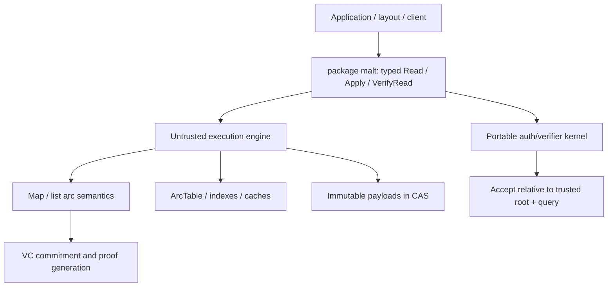

# MALT

[](https://github.com/dewebprotocol/malt/actions/workflows/go.yml)
[](LICENSE)

**MALT is a general, arc-granularity graph data-authentication system.**

MALT keeps payload bytes in ordinary content-addressed storage (CAS) and uses
vector-commitment (VC) backends to authenticate typed relations. Applications
read and verify `trusted root + typed query -> result` without treating a
Merkle-DAG block chain as the application proof path.

This repository is the MALT core specification implementation. It owns the
verifier-facing semantics, ProofList behavior, root/query/result contracts,
wire formats, reference runtime, and core benchmark/evaluation framework. The
managed product gateway lives outside this repository.

[Documentation](./docs/README.md) · [Architecture](./ARCHITECTURE.md) ·
[Concepts](./docs/concepts/README.md) ·
[Threat Model](./docs/policy/threat-model.md) ·
[Compatibility](./docs/policy/compatibility.md) · [Evaluation](./docs/evaluation.md) ·
[MIPs](./docs/mips/README.md) ·
[Roadmap](./ROADMAP.md) · [Security](./SECURITY.md) ·
[Contributing](./CONTRIBUTING.md)

MALT targets data whose relationships can be normalized into graph-shaped
objects and arcs. Example workloads include
verifiable local-first files, persistent agent memory, mutable manifests, and
tamper-evident audit trails over Filecoin, IPFS, S3, local CAS, or another
object store. UnixFS is one current layout over the core, not the core model.

MALT authenticates arcs through list/map semantics, typed roots, VC proofs, and
verifier-facing ProofLists. Immutable payload bytes keep ordinary CIDs. The
daemon, gateway, cache, ArcTable, and other materialized indexes are untrusted
execution state rather than correctness authorities.

MALT also makes verifiable reads work over ordinary HTTP(S): content routes can
return the application result in the response body and carry proof evidence in
`X-Malt-ProofList`, so clients verify `root + path -> result` without trusting
the gateway or downloading the Merkle-DAG traversal chain.

For background on hashes, Merkle trees, Merkle DAGs, and MALT's data
authentication model, see
[Data authentication background](./docs/concepts/data-authentication.md).

**Status:** Experimental reference implementation. Runnable end to end, not
production-ready.

## Why This Exists

Traditional Merkle-DAG traversal authenticates structure by embedding child
links in parent blocks. That implicit arc couples payload serialization,
relation authentication, and traversal/proof material at block granularity. A
local relation change can therefore force rootward object rewrites.

MALT separates payload storage, arc authentication, and execution/access:

- immutable payload content can remain ordinary CAS data
- typed arcs are committed and proved by VC backends under independent roots
- ArcTable, indexes, caches, daemons, and gateways may accelerate execution
  without entering the verifier trust boundary
- list/map semantics define typed read and write operations
- flat `root + path` lookups return dedicated, fixed-size `ProofList` evidence
  for each semantic lookup
- content reads can return normal HTTP bodies plus `X-Malt-ProofList` headers
- clients verify `root + path -> result` without trusting gateways, caches, or
  materialized indexes
- local structure updates advance structure roots without rewriting unrelated
  payload objects

The claim is not that updates are free. MALT replaces Merkle-DAG object-chain
proofs and implicit ancestor-rewrite cost with explicit, verifiable arc
maintenance whose performance remains backend- and workload-dependent.

## Repository Boundary

This repository owns:

- MALT core semantics and verifier-facing contracts
- root CID, ProofList, and wire-format documentation
- reference CLI, daemon, HTTP server, and local/mock CAS surfaces
- component benchmarks, conformance tests, and end-to-end evaluation harnesses
- implementation-bound MIPs and evaluator schemas

This repository does not own production managed-gateway behavior:

- tenant isolation, identity providers, API keys, or authorization policy
- root publication, latest-head, freshness, or multi-writer product policy
- S3/Filecoin/IPFS production backend orchestration
- quota, billing, pinning, garbage collection, abuse control, or operations

Those deployment and product concerns belong in the separate
`DeWebProtocol/gateway` repository or private deployment overlays.

## Current Architecture



The engine may produce a candidate result and proof, but only portable
verification establishes correctness. ArcTable is reusable materialization,
not a trust root. Payloads remain immutable CAS objects.

## Current Status

MALT is an experimental reference implementation. It is runnable end to end, but
its public APIs, ProofList schemas, wire formats, and deployment policies may
change. It is not production-ready.

Current in-tree capabilities:

- root-centric `malt` CLI for local daemon lifecycle, add, resolve, and verify
- reference/evaluation HTTP surface for explicit-root HTTP reads and writes
- HTTP-native content reads for file bytes, directory JSON, and byte ranges,
  with proof evidence carried in `X-Malt-ProofList`
- fixed-size proof material for flat `root + path` semantic lookups
- pure MALT UnixFS-style layout built from map/list semantics and CAS-backed
  immutable payloads
- stateless commitment backends for semantic proof primitives
- ArcTable-backed structure materialization with overwrite and versioned modes
- `malt-eval` workloads for read queries, write traces, CAS models, proof
  overhead, and storage overhead

Current experimental boundaries:

- no managed global head publication service
- no multi-writer merge or freshness protocol
- no tenant, quota, pinning, or garbage-collection policy
- no production managed gateway or hosted service semantics
- no stable public API compatibility guarantee yet
- large-file byte-range response bodies must be bound to authenticated segment CIDs with layout/unixfs.VerifyRangeBody after ProofList verification

The core facade and ProofList binding rules introduced for `v0.0.3` use the
experimental `v0alpha1` profile. The first candidate is `v0.0.3-rc.1`; after
release validation the final tag must be exactly `v0.0.3`.

## Use Cases

### Verifiable Agent Memory

Agents can update named memory, artifacts, checkpoints, and audit records while
clients verify that resolved objects belong to an accepted structure root.

### Local-First Files And Directories

Applications can model files and directories using authenticated map/list
semantics while retaining immutable content-addressed payload blocks.

### Mutable Manifests And Audit Trails

MALT can authenticate evolving manifests, registries, and ordered records
without embedding every mutable relationship into payload object identity.

MALT is storage-backend independent. Filecoin, IPFS, S3, and local CAS systems
provide payload storage; MALT provides authenticated mutable structure,
resolution, and verification above those payload objects. MALT is not a
replacement for Filecoin, IPFS, Kubo, S3, or a general-purpose object store.

## Quick Start

Prerequisites:

- Go 1.25.7 or newer
- Git

Build the three local binaries:

```bash
mkdir -p bin
go build -buildvcs=false -o bin/malt ./cmd/malt
go build -buildvcs=false -o bin/cas ./cmd/cas
go build -buildvcs=false -o bin/malt-eval ./cmd/eval/malt-eval
```

Initialize the local runtime. The default configuration expects an external CAS
at `127.0.0.1:4318` and a daemon API at `127.0.0.1:4317`. For local development
without a real IPFS node, start the standalone mock CAS server first:

```bash
bin/cas start
```

Then initialize and start the daemon:

```bash
bin/malt init --non-interactive
bin/malt start
bin/malt status
```

Add a file, resolve it, and verify the returned ProofList:

```bash
printf 'hello malt\n' >/tmp/malt-hello.txt
ROOT=$(bin/malt add /tmp/malt-hello.txt | awk '/Result root:/ {print $3}')
bin/malt resolve "$ROOT" malt-hello.txt >/tmp/malt-resolve.json
bin/malt verify --prooflist /tmp/malt-resolve.json
```

This example stores file bytes through the configured local CAS, produces a
MALT structure root, resolves a path relative to that root, and verifies the
returned target and ProofList against the trusted root.

Stop the managed daemon when finished:

```bash
bin/malt stop
```

## Developer Workflow

Run the full Go validation suite from the repository root:

```bash
go test ./...
go vet ./...
```

Inspect the command surfaces:

```bash
bin/malt --help
bin/malt-eval --help
bin/malt-eval schema
```

Run the local smoke evaluation plan:

```bash
bin/malt-eval run --plan examples/eval-smoke-plan.json --run-id smoke
```

The evaluator writes disposable workspace state under `output/<run_id>` and
durable result artifacts under `result/<run_id>`. Those directories are ignored
by git.

## Core Model

MALT's current implementation is easiest to read through these layers:

| Layer | Role |
| --- | --- |
| Portable auth kernel | Canonical arcs, typed roots, VC verification, and ProofList validation |
| Root `malt` facade | Typed `Query`, `ReadRequest`, `ReadResult`, `Engine.Read`, `Apply`, and `VerifyRead` |
| Semantic layer | Abstract map/list arc read and mutation semantics |
| Execution engine | Proof generation, writer orchestration, and operational scope; untrusted for correctness |
| ArcTable | Optional namespace-scoped materialization outside the trust boundary |
| Application layout | Domain model above typed arcs and immutable payload objects; UnixFS is one layout |

The verifier-facing shape is:

```text
Read(ReadRequest{Root, Query}) -> ReadResult{Target, Segments, ProofList}
VerifyRead(request, result) -> valid / invalid

Apply(semantic mutation with base root) -> result root + write receipt
```

`list` describes stable-indexed child references. `map` describes authenticated
key-to-target relations. `@payload` is a reserved standard coordinate but is
optional for generic maps; the UnixFS layout requires it. Layouts translate
source-domain data into typed queries and semantic mutations without defining
the core semantics.

`graph` is not a separate semantic owner or node-interface hierarchy. In the
current runtime it is a small composition boundary that wires resolver and
writer ports over the list/map semantic APIs. Resolver traversal belongs to
`graph/resolver`; mutation application belongs to `graph/writer`.

For a deeper implementation walkthrough, see [ARCHITECTURE.md](./ARCHITECTURE.md).

## Repository Layout

```text
cmd/malt/                      reference runtime CLI
cmd/eval/                      malt-eval workloads, schemas, and helpers
api/http/                      daemon request/response DTOs
auth/                          portable arc, commitment, proof, semantics, and verifier kernel
core.go, engine.go             module-root typed MALT facade
graph/                         resolver and writer port definitions/adapters
layout/unixfs/                 UnixFS-style layout over map/list semantics and CAS-backed payloads
runtime/                       node, runtime graph composition, ArcTable, metrics
sdk/client/                    Go daemon client facade
server/                        reference daemon and evaluation HTTP server
storage/                       CAS and KV storage libraries
wire/maltcid/                  MALT map/list root CID codecs
docs/                          implementation docs: policy, evaluation, specs, and MIPs
examples/                      small runnable plans and examples
```

## Evaluation

MALT's evaluator focuses on the core performance questions behind the project:

- whether path lookup remains practical as logical depth grows
- whether flat authenticated lookup scales with key count
- whether real update traces avoid Merkle-DAG-style structural rewrite
  amplification

See [docs/evaluation.md](./docs/evaluation.md) for the current
benchmark suites and commands. Detailed paper tables and figure interpretation
live in the research documents workspace.

## Roadmap

The near-term roadmap is focused on stabilizing proof schemas, evaluator
outputs, and the UnixFS-style layout boundary before claiming production
readiness. See [ROADMAP.md](./ROADMAP.md).

## Contributing

Contributions are welcome. Start with [CONTRIBUTING.md](./CONTRIBUTING.md),
keep changes small, and include focused tests for behavior changes.

Please report security issues through the private process in
[SECURITY.md](./SECURITY.md), not through public issues.

## License

MALT is released under the [MIT License](./LICENSE).
