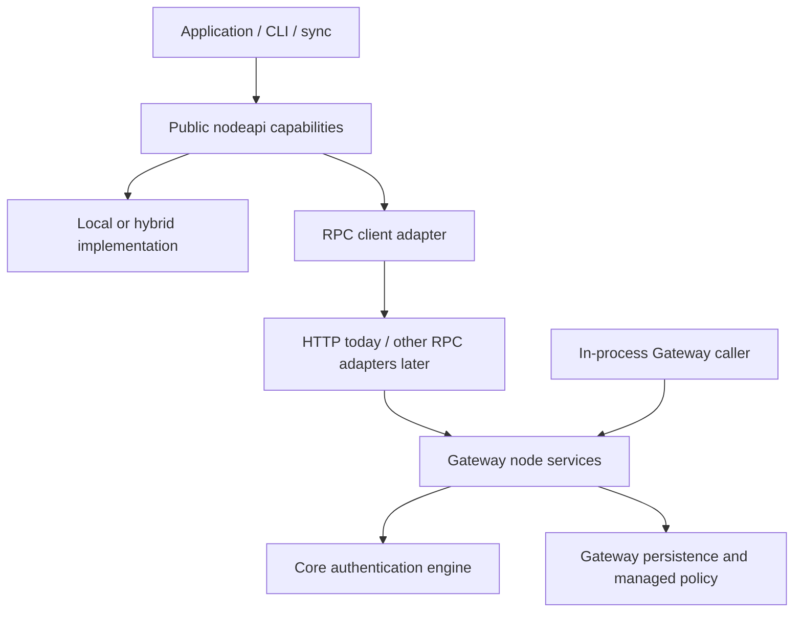

# Public Node API

`github.com/dewebprotocol/malt-client/nodeapi` defines the transport-independent
service contract shared by the local runtime and Gateway. A consumer selects
narrow capabilities instead of depending on an HTTP client or one large Node
interface. Core remains the authority for authentication semantics and types.

## Contract

| Capability | Operations | Meaning of success |
| --- | --- | --- |
| `CAS` | `Put`, `PutWithCodec`, `Get`, `Has` | Immutable bytes and write identities are CID-bound |
| `BatchCAS` | Ordered `PutBatch`, `HasBatch` | The same CAS semantics; optional batching |
| `Authentication` | `Authenticate` | Untrusted Core evidence for the caller's exact request |
| `AuthenticationWriter` | `AuthenticationCandidate`, `MaterializeAuthentication` | Complete candidate transfer for the exact Root |
| `AuthenticationBatch` | `MaterializeAuthenticationBatch` | Core receipt for the exact dependency-ordered batch |
| `DatasetBranch` | `DatasetBinding`, `ObserveHead`, `ApplyCandidate` | Untrusted branch observations and explicit publication results |

A successful pointer result is non-nil. Candidate schema validation and Root
identity checks happen before writes or before returning a candidate. They do
not replace cryptographic verification of exported state or query evidence.
Authentication values and receipts use Core's existing `protocol` types.

Services honor context cancellation before effects. CAS `Get` returns
caller-owned bytes, binds them to the requested CID, and reports missing blocks
with `ErrNotFound`; corrupted bytes or write identities report
`ErrCorruptedBlock`. Batch results retain input order and validated statuses.
CAS batch failure may leave a verified subset stored, so callers retry the
complete immutable batch. A materialization receipt does not promise replication
or a transaction spanning payloads, authentication state, and publication.

`DatasetBranch` is bound to one dataset and normalized branch. Applications use
`NormalizeApplyRequest`, `ValidateObservedHead`, and `ValidateApplyResult` to
check identity and result relationships. Base commit, root and non-zero revision
must be supplied together. Operation IDs bind retries to the same request.
Branch normalization is idempotent: `heads/topic` selects the logical branch
`topic`, while `heads/heads/topic` selects the distinct logical branch
`heads/topic` and retains its full selector through binding, transport and
validation. Adapters must not strip the namespace from a normalized selector.
`MergePolicy: "preserve"` retains a stale candidate on a conflict branch without
asking the service to compute a merged Root. A `branched` result is a successful
conflict-preservation outcome; the HTTP adapter maps it to status 409.

## Ownership and adapters

The contract lives above Core in the runtime module, whose current module name
remains `github.com/dewebprotocol/malt-client`. Gateway imports only `nodeapi`
from this module in production. It retains its own storage, scope lifecycle,
managed authority, quotas, and versioning implementation. No repository cycle
or Gateway dependency is introduced into the local runtime.

Gateway's `internal/runtime` implements authentication and CAS execution.
`internal/nodeservice` applies managed Bucket authority, payload ownership,
metadata entitlement, and branch publication independently of HTTP. Its bound
capabilities receive an already authenticated principal and recheck permissions
and lifecycle on every operation; their constructors are not authentication
endpoints. HTTP retains credential decoding, origin checks, wire limits,
serialization, and status/header mapping. Operator/evaluation capabilities and
Merkle DAG compatibility stay separate from the public native Node API.

`transport.Client` implements the same public contracts over current Gateway
HTTP routes. `transport/local` and `transport/hybrid` implement CAS, and
`bucketsync` consumes `DatasetBranch` directly. Application-specific narrow
interfaces can remain smaller than these public capabilities when appropriate.
No compatibility alias remains at `transport/capability` or
`transport/capabilitytest`; source consumers migrate to `nodeapi` and
`nodeapi/nodetest` together with the matching Gateway revision.

The reusable `nodetest.RunCAS`, `RunAuthentication`, and `RunDataset` suites run
against real in-process Gateway services and the HTTP client. The CAS suite
also covers local and hybrid implementations. These tests check publication
separation, local proof verification, exact identities, retries, cancellation,
caller-owned results, and stale-writer conflict preservation.

## Synchronization and local trust

Synchronization orchestrates Node API calls. Payload upload, candidate
materialization, branch publication, observation, and local acceptance remain
separate stages. Existing `bucketsync` persists the base, pending operation and
remote observation; `trust` alone decides local acceptance. Neither an in-process
call nor a remote success is a trust shortcut.

This refactor establishes the common service boundary. It does not add a
CouchDB-compatible protocol, WebSocket or gRPC transport, a full autonomous local
authentication store, or a new replication engine. Current local-only execution
provides CAS; native backup/mount/write-back still compose Gateway or hybrid
capabilities. New local executors and network transports can implement the same
contracts without changing Core or synchronization's authority over local roots.
